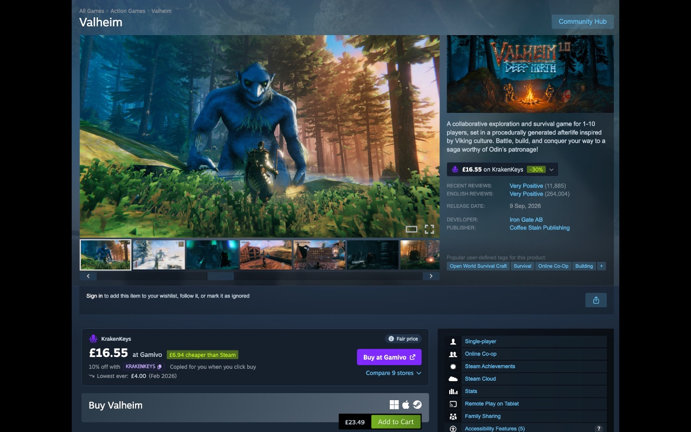
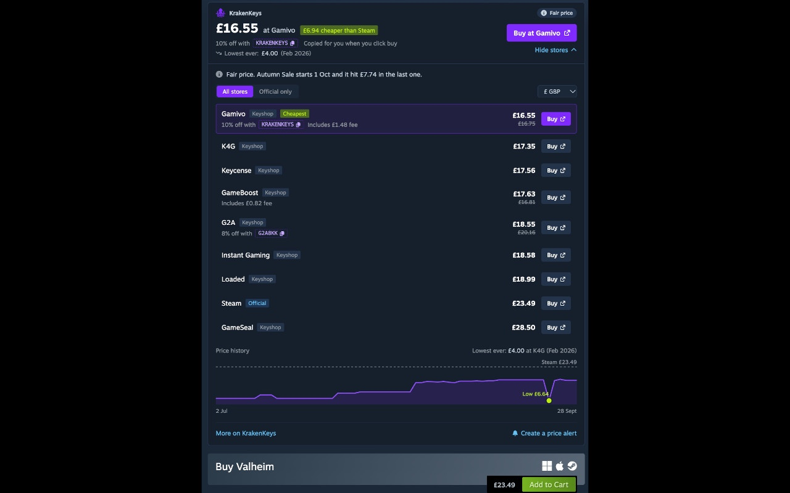

# KrakenKeys for Steam

A browser extension that shows you the cheapest place to buy a game while you're looking at it on Steam.

I built [KrakenKeys](https://krakenkeys.com), and found myself often having two tabs open. I thought I might as well create a browser extension to make it even easier to find great Steam deals.



## What it does

When you open a game on the Steam store, you'll see a small KrakenKeys box above the buy button:

- The cheapest price KrakenKeys can find, and which store has it
- How much you'd save compared with Steam
- Fees and coupon codes already worked into the price (where possible), so there are no surprises at checkout
- Whether it's a good time to buy, based on the price history
- The lowest price it's ever been
- Copy coupon codes
- Last 90 day price graph

If Steam is already the cheapest, it'll tell you that too.



## Privacy

When you open a game on Steam, the extension sends that game's ID and your chosen currency to KrakenKeys so it can look up prices. It doesn't send cookies, it only runs on Steam game pages and it doesn't read anything on the page apart from the game ID in the address bar.

Like any website, our server sees your IP address and basic browser details. We use your approximate country to show prices for your region, and your IP address to stop the service being abused.

Buy links go through krakenkeys.com first. We log the click, including the game, the store, your IP address and browser details, and record it in PostHog, our analytics tool. It's the same as clicking a store link on the website, and it's how stores know to credit us.

Your settings stay in your browser, and removing the extension deletes them. The full privacy policy is at [krakenkeys.com/browser-extension](https://krakenkeys.com/browser-extension#privacy-policy).

## Install

It'll be on the Chrome Web Store and Firefox Add-ons soon. Until then you can build it yourself (see below) and load it as an unpacked extension.

## Running it locally

You'll need Node 22 or newer and pnpm.

```bash
nvm use
pnpm install
cp .env.example .env.development
pnpm dev
```

`.env.development` points the extension at a local copy of the KrakenKeys site. Leave `WXT_API_BASE` out to use the live site.

Then load it in your browser:

- **Chrome:** go to `chrome://extensions`, turn on developer mode, click "Load unpacked" and pick `.output/chrome-mv3-dev`
- **Firefox:** run `pnpm dev:firefox`, go to `about:debugging`, click "This Firefox", then "Load Temporary Add-on" and pick `.output/firefox-mv2-dev/manifest.json`

Changes reload on their own while `pnpm dev` is running.

## Building the release from source

This is how the version on the Chrome Web Store and Firefox Add-ons is built. 

1. Use Node 22 (see `.nvmrc`) and pnpm 9.15.9. Running `corepack enable` sets up the right pnpm version for you.
2. Install the exact dependency versions from the lockfile:

   ```bash
   pnpm install --frozen-lockfile
   ```

3. Build and package it:

   ```bash
   pnpm zip:firefox
   ```

   ```bash
   pnpm zip
   ```

The Firefox build ends up in `.output/firefox-mv2` and the Chrome build in `.output/chrome-mv3`, alongside the zips that get uploaded to each store.

## Useful commands

| Command | What it does |
| --- | --- |
| `pnpm dev` | Runs the extension in Chrome with live reload |
| `pnpm test` | Runs the tests |
| `pnpm compile` | Type checks everything |
| `pnpm build` | Makes a production build |
| `pnpm zip` / `pnpm zip:firefox` | Makes the files for the Chrome and Firefox stores |

## How it's built

[WXT](https://wxt.dev), Vue 3, TypeScript and Tailwind.

- `entrypoints/steam.content/` is what appears on Steam
- `entrypoints/popup/` is the settings popup
- `entrypoints/background.ts` talks to the KrakenKeys API and caches results for 30 mins (may change this)
- `components/` and `utils/` are shared between them

## Found a bug or have an idea?

I'd love to hear it. [Open an issue](../../issues/new) and tell me:

- What you expected to happen
- What actually happened
- The Steam game you were looking at, and your browser

Screenshots help a lot.

I'm planning on adding a wishlist integration soon. I'd like to launch the browser extension first, and then I'll roll it out.

## Sending a pull request

Pull requests are welcome.

1. Fork the repo and create a branch from `main`
2. Make your change and keep it focused on one thing
3. Run `pnpm test` and `pnpm compile` and make sure both pass
4. Open a pull request saying what you changed and why, with a screenshot if it changes how something looks

If you're planning something bigger, open an issue first so we can chat before you put the time/effort in.
